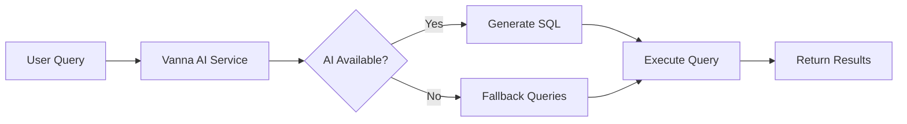

# Flowbit Analytics Dashboard

> **A comprehensive data analytics platform with AI-powered natural language querying, built for modern invoice and vendor management.**

[](https://vercel.com/new/clone?repository-url=https://github.com/yourusername/flowbit-analytics)
[](https://board-gamma-three.vercel.app)

## 🎯 Overview

Flowbit Analytics is a full-stack data analytics platform that transforms invoice and vendor data into actionable insights. Built with modern technologies and featuring AI-powered natural language queries, it provides an intuitive interface for business intelligence and financial analytics.

### Key Features

- 📊 **Interactive Dashboard** - Real-time charts, metrics, and KPIs
- 🤖 **AI-Powered Queries** - Natural language to SQL using Vanna AI + Groq
- 📄 **Invoice Management** - Complete CRUD operations with advanced filtering
- 📈 **Advanced Analytics** - Vendor performance, spend analysis, and trends
- 💬 **Chat Interface** - Conversational data exploration
- 📱 **Responsive Design** - Mobile-first UI with Tailwind CSS + shadcn/ui
- 🔄 **Real-time Updates** - Live data synchronization
- 📤 **Data Export** - CSV/Excel export functionality
- 🔐 **Role-based Access** - Admin, manager, user, and viewer roles

## 🏗️ Architecture

```
┌─────────────────┐    ┌─────────────────┐    ┌─────────────────┐
│   Next.js Web   │    │   Express API   │    │  Vanna AI       │
│   (Frontend)    │◄──►│   (Backend)     │◄──►│  (NL to SQL)    │
│   Port: 3000    │    │   Port: 4001    │    │   Port: 8000    │
└─────────────────┘    └─────────────────┘    └─────────────────┘
         │                       │                       │
         └───────────────────────┼───────────────────────┘
                                 ▼
                    ┌─────────────────┐
                    │  PostgreSQL     │
                    │  Database       │
                    │  Port: 5432     │
                    └─────────────────┘
```

## 🚀 Quick Start

### Prerequisites

- Node.js 18+ and npm
- PostgreSQL 15+
- Git

### 1. Clone & Install

```bash
git clone https://github.com/yourusername/flowbit-analytics.git
cd flowbit-analytics
npm install
```

### 2. Environment Setup

```bash
cp .env.example .env
# Edit .env with your configuration
```

### 3. Database Setup

```bash
# Run migrations
npx prisma migrate dev

# Seed with test data
npm run seed
```

### 4. Start Development

```bash
# Start all services
npm run dev

# Or start individually
npm run dev:web    # Frontend (http://localhost:3000)
npm run dev:api    # Backend (http://localhost:4001)
npm run dev:vanna  # AI Service (http://localhost:8000)
```

### 5. Docker Setup (Alternative)

```bash
# Start all services with Docker
docker-compose up -d

# View logs
docker-compose logs -f
```

## 📁 Project Structure

```
flowbit-analytics/
├── apps/
│   ├── web/                 # Next.js Frontend
│   │   ├── app/            # App Router pages
│   │   ├── components/     # React components
│   │   └── lib/           # Utilities
│   ├── api/                # Express Backend
│   │   ├── src/
│   │   │   ├── routes/    # API endpoints
│   │   │   ├── lib/       # Database & utilities
│   │   │   └── index.ts   # Server entry
│   │   └── Dockerfile
│   ├── vanna/              # Vanna AI Service
│   │   ├── app.py         # Flask application
│   │   ├── requirements.txt
│   │   └── Dockerfile
│   └── services/           # Business logic
├── data/
│   └── Analytics_Test_Data.json  # Sample dataset
├── docs/
│   ├── API_DOCUMENTATION.md      # API reference
│   └── DATABASE_SCHEMA.md        # Database design
├── prisma/
│   ├── schema.prisma      # Database schema
│   └── migrations/        # Migration files
├── scripts/
│   └── seed-database.ts   # Database seeding
├── docker-compose.yml     # Docker configuration
├── .env.example          # Environment template
└── README.md
```

## 🌐 Deployment

### Frontend (Vercel)

1. Connect your GitHub repository to Vercel
2. Set environment variables:
   ```bash
   NEXT_PUBLIC_API_URL=https://your-app.vercel.app
   DATABASE_URL=your_postgresql_connection_string
   VANNA_API_BASE_URL=https://your-vanna.onrender.com
   ```
3. Deploy automatically on push to main

### Backend API (Vercel Functions)

The Express API is automatically deployed as Vercel serverless functions alongside the frontend.

### Vanna AI Service (Render)

1. Create a new Web Service on Render
2. Connect your repository
3. Set build command: `pip install -r requirements.txt`
4. Set start command: `python app.py`
5. Add environment variables:
   ```bash
   DATABASE_URL=your_postgresql_connection_string
   GROQ_API_KEY=your_groq_api_key_here
   GROQ_MODEL=mixtral-8x7b-32768
   ```

### Database (Supabase/Railway/Neon)

1. Create a PostgreSQL database
2. Run migrations: `npx prisma migrate deploy`
3. Seed data: `npm run seed`

## 📊 API Documentation

### Core Endpoints

| Method | Endpoint | Description |
|--------|----------|-------------|
| GET | `/api/dashboard` | Dashboard overview data |
| GET | `/api/invoices` | Paginated invoice list |
| GET | `/api/stats` | Statistical data for charts |
| POST | `/api/chat-with-data` | Natural language queries |
| GET | `/api/export/invoices` | Export invoice data |

### Chat Workflow



**Supported Query Types:**
- "Show me the top 5 vendors by spend"
- "What's the total spend in the last 90 days?"
- "Which invoices are overdue?"
- Custom SQL generation via AI

For complete API documentation, see [`docs/API_DOCUMENTATION.md`](docs/API_DOCUMENTATION.md).

## 🗄️ Database Schema

The application uses a normalized PostgreSQL schema with the following core entities:

- **Vendors** - Supplier information
- **Customers** - Client data
- **Invoices** - Financial transactions
- **Documents** - File metadata
- **LineItems** - Invoice details
- **Analytics** - Processing metrics
- **ChatHistory** - Query logs

For detailed schema documentation, see [`docs/DATABASE_SCHEMA.md`](docs/DATABASE_SCHEMA.md).

## 🧪 Testing

```bash
# Run unit tests
npm test

# Run integration tests
npm run test:integration

# Run E2E tests
npm run test:e2e

# Test coverage
npm run test:coverage
```

## 🔧 Development

### Available Scripts

```bash
npm run dev          # Start all development servers
npm run build        # Build for production
npm run start        # Start production server
npm run lint         # Run ESLint
npm run type-check   # TypeScript type checking
npm run seed         # Seed database with test data
npm run migrate      # Run database migrations
```

### Code Quality

- **TypeScript** - Full type safety
- **ESLint** - Code linting
- **Prettier** - Code formatting
- **Husky** - Git hooks
- **Prisma** - Type-safe database access

## 🎨 UI Components

Built with modern, accessible components:

- **shadcn/ui** - High-quality React components
- **Tailwind CSS** - Utility-first styling
- **Recharts** - Interactive data visualization
- **Lucide Icons** - Beautiful icons
- **Radix UI** - Accessible primitives

## 🔐 Security

- **CORS** - Configured for production domains
- **Rate Limiting** - API endpoint protection
- **Input Validation** - Request sanitization
- **SQL Injection Prevention** - Parameterized queries
- **Environment Variables** - Secure configuration

## 📈 Performance

- **Next.js 14** - App Router with streaming
- **Server Components** - Reduced client bundle
- **Database Indexing** - Optimized queries
- **Caching** - Redis integration ready
- **CDN** - Static asset optimization

## 🤝 Contributing

1. Fork the repository
2. Create a feature branch: `git checkout -b feature/amazing-feature`
3. Commit changes: `git commit -m 'Add amazing feature'`
4. Push to branch: `git push origin feature/amazing-feature`
5. Open a Pull Request

## 📄 License

This project is licensed under the MIT License - see the [LICENSE](LICENSE) file for details.

## 🙏 Acknowledgments

- [Vanna AI](https://vanna.ai/) - Natural language to SQL
- [Groq](https://groq.com/) - Fast LLM inference
- [Vercel](https://vercel.com/) - Deployment platform
- [Supabase](https://supabase.com/) - PostgreSQL hosting
- [shadcn/ui](https://ui.shadcn.com/) - UI components

## 📞 Support

- 📧 Email: support@flowbit.com
- 💬 Discord: [Join our community](https://discord.gg/flowbit)
- 📖 Documentation: [docs.flowbit.com](https://docs.flowbit.com)
- 🐛 Issues: [GitHub Issues](https://github.com/yourusername/flowbit-analytics/issues)

---

<div align="center">
  <strong>Built with ❤️ for modern data analytics</strong>
</div>
