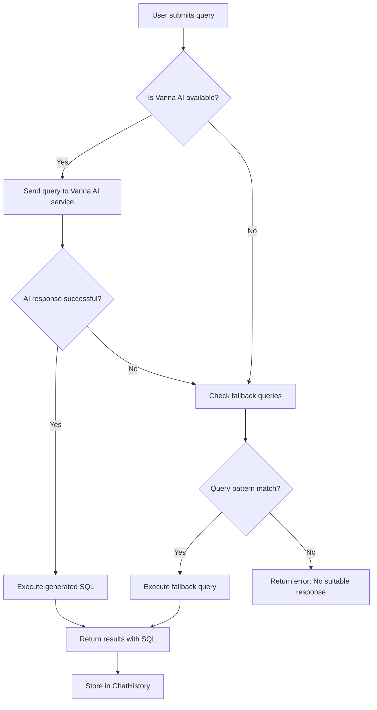

# API Documentation

## Base URL
- **Development**: `http://localhost:4001/api`
- **Production**: `https://your-app.vercel.app/api`

## Authentication
Currently, the API does not require authentication for most endpoints. Future versions will implement JWT-based authentication.

## Response Format
All API responses follow this standard format:

```json
{
  "success": boolean,
  "data": object | array,
  "error": string | null,
  "message": string
}
```

## Endpoints

### Health Check

#### GET `/test`
Basic health check endpoint to verify API is running.

**Response:**
```json
{
  "message": "API is working",
  "timestamp": "2024-11-12T13:11:06.684Z"
}
```

#### GET `/health`
Detailed health check with system information.

**Response:**
```json
{
  "status": "ok",
  "timestamp": "2024-11-12T13:11:06.684Z",
  "uptime": 3600,
  "environment": "development"
}
```

### Analytics & Dashboard

#### GET `/dashboard`
Get dashboard overview data including key metrics.

**Response:**
```json
{
  "success": true,
  "data": {
    "totalInvoices": 24,
    "totalAmount": 31631.15,
    "avgInvoiceValue": 1317.96,
    "pendingInvoices": 18,
    "overdueInvoices": 0,
    "topVendors": [
      {
        "name": "ABC Seller",
        "totalSpend": 9290,
        "invoiceCount": 2
      }
    ]
  }
}
```

#### GET `/stats`
Get statistical data for charts and analytics.

**Response:**
```json
{
  "success": true,
  "data": {
    "monthlySpend": [
      {"month": "2024-01", "amount": 15000},
      {"month": "2024-02", "amount": 16631.15}
    ],
    "vendorDistribution": [
      {"vendor": "ABC Seller", "percentage": 29.4},
      {"vendor": "EasyFirma GmbH", "percentage": 26.9}
    ],
    "paymentStatus": {
      "paid": 6,
      "pending": 18,
      "overdue": 0
    }
  }
}
```

#### GET `/analytics`
Get detailed analytics data.

**Response:**
```json
{
  "success": true,
  "data": {
    "processingStats": {
      "totalDocuments": 24,
      "processedDocuments": 24,
      "validatedDocuments": 20,
      "avgConfidence": 0.95
    },
    "trends": {
      "weeklyGrowth": 12.5,
      "monthlyGrowth": 8.3
    }
  }
}
```

### Invoice Management

#### GET `/invoices`
Get paginated list of invoices with optional filtering.

**Query Parameters:**
- `page` (number): Page number (default: 1)
- `limit` (number): Items per page (default: 10)
- `status` (string): Filter by payment status
- `vendor` (string): Filter by vendor name
- `startDate` (string): Filter by date range start (ISO format)
- `endDate` (string): Filter by date range end (ISO format)

**Response:**
```json
{
  "success": true,
  "data": {
    "invoices": [
      {
        "id": 1,
        "invoiceRef": "INV-2024-001",
        "invoiceDate": "2024-01-15",
        "totalAmount": 1250.00,
        "currency": "EUR",
        "paymentStatus": "pending",
        "paymentDueDate": "2024-02-15",
        "vendor": {
          "id": 1,
          "name": "ABC Seller"
        },
        "customer": {
          "id": 1,
          "name": "Customer Name"
        }
      }
    ],
    "pagination": {
      "page": 1,
      "limit": 10,
      "total": 24,
      "pages": 3
    }
  }
}
```

#### GET `/invoices/:id`
Get detailed information for a specific invoice.

**Response:**
```json
{
  "success": true,
  "data": {
    "id": 1,
    "invoiceRef": "INV-2024-001",
    "invoiceDate": "2024-01-15",
    "deliveryDate": "2024-01-10",
    "subTotal": 1000.00,
    "totalTax": 250.00,
    "totalAmount": 1250.00,
    "currency": "EUR",
    "paymentTerms": "Net 30",
    "paymentStatus": "pending",
    "paymentDueDate": "2024-02-15",
    "vendor": {
      "id": 1,
      "name": "ABC Seller",
      "address": "123 Business St",
      "taxId": "DE123456789"
    },
    "lineItems": [
      {
        "id": 1,
        "description": "Product A",
        "quantity": 2,
        "unitPrice": 500.00,
        "totalPrice": 1000.00,
        "vatRate": 25.0,
        "vatAmount": 250.00
      }
    ]
  }
}
```

### AI Chat & Query System

#### POST `/chat-with-data`
Main endpoint for natural language queries that get converted to SQL and executed.

**Request Body:**
```json
{
  "query": "Show me the top 5 vendors by total spend"
}
```

**Response (Success):**
```json
{
  "success": true,
  "answer": "Here are the top 5 vendors by spend (using fast database query).",
  "sql": "SELECT v.name as vendor_name, SUM(i.total_amount) as total_spend, COUNT(i.id) as invoice_count FROM \"Invoice\" i JOIN \"Vendor\" v ON i.vendor_id = v.id GROUP BY v.id, v.name ORDER BY total_spend DESC LIMIT 5;",
  "results": [
    {
      "vendor_name": "ABC Seller",
      "total_spend": 9290,
      "invoice_count": 2
    },
    {
      "vendor_name": "EasyFirma GmbH & Co KG",
      "total_spend": 8520,
      "invoice_count": 3
    }
  ]
}
```

**Response (Error):**
```json
{
  "success": false,
  "error": "AI service not configured and no fallback available for this query.",
  "answer": "The AI service is not available. Try asking: 'Show top vendors', 'Total spend', or 'Overdue invoices'.",
  "sql": null,
  "results": []
}
```

**Supported Query Types:**
- Top vendors: "show top 5 vendors", "top vendors by spend"
- Total spend: "total spend", "what's the total amount"
- Overdue invoices: "overdue invoices", "which invoices are overdue"
- Custom SQL (when Vanna AI is available)

### Data Export

#### GET `/export/invoices`
Export invoice data in various formats.

**Query Parameters:**
- `format` (string): Export format (csv, xlsx, json) - default: csv
- `startDate` (string): Date range start (ISO format)
- `endDate` (string): Date range end (ISO format)
- `status` (string): Filter by payment status

**Response:**
- Content-Type: `text/csv`, `application/vnd.openxmlformats-officedocument.spreadsheetml.sheet`, or `application/json`
- Content-Disposition: `attachment; filename="invoices_export.csv"`

#### GET `/export/vendors`
Export vendor data with spend analytics.

**Query Parameters:**
- `format` (string): Export format (csv, xlsx, json) - default: csv

**Response:**
CSV format with columns: vendor_name, total_spend, invoice_count, avg_invoice_value

### Chat History

#### GET `/chat/history`
Get chat history for the current session.

**Query Parameters:**
- `limit` (number): Number of recent queries to return (default: 50)

**Response:**
```json
{
  "success": true,
  "data": [
    {
      "id": 1,
      "query": "Show top vendors",
      "sql": "SELECT v.name...",
      "results": [...],
      "createdAt": "2024-11-12T13:00:00Z"
    }
  ]
}
```

#### POST `/chat/save`
Save a chat interaction to history.

**Request Body:**
```json
{
  "query": "Show top vendors",
  "sql": "SELECT v.name...",
  "results": [...],
  "error": null
}
```

## Error Codes

| Code | Description |
|------|-------------|
| 200 | Success |
| 400 | Bad Request - Invalid parameters |
| 404 | Not Found - Resource doesn't exist |
| 500 | Internal Server Error |
| 503 | Service Unavailable - External service down |

## Rate Limiting
- 100 requests per 15-minute window per IP address
- Chat endpoints: 20 requests per minute per IP

## CORS Policy
- Development: All origins allowed
- Production: Only specified domains in ALLOWED_ORIGINS environment variable

## Chat Workflow & AI Processing

### Overview
The chat system provides natural language to SQL processing with intelligent fallback mechanisms. It integrates Vanna AI (powered by Groq) for advanced query generation with built-in database queries as backup.

### Processing Flow



### Key Components

1. **Primary Processing (Vanna AI)**:
   - Uses Groq LLM for natural language to SQL conversion
   - Accesses full database schema context
   - Generates custom SQL for any query type
   - Provides high flexibility for complex queries

2. **Fallback System**:
   - Activates when Vanna AI is unavailable (503, timeout, etc.)
   - Supports predefined query patterns
   - Uses direct database queries (Prisma ORM)
   - Fast, reliable responses

3. **Query Processing Steps**:
   - **User Input**: Natural language text
   - **Intelligent Routing**: Vanna AI → Fallback → Error
   - **SQL Generation**: AI-generated or template-based
   - **Database Execution**: Safe parameterized queries
   - **Result Formatting**: JSON with original query and SQL
   - **Audit Logging**: All interactions stored in ChatHistory

### Supported Query Types

#### AI-Generated Queries (Vanna AI)
Any natural language query that can be translated to SQL:
- "Show me invoices from vendor ABC Ltd between Jan and Mar"
- "What's the average invoice amount for tech companies?"
- "Find customers who spent over 10,000 euros last month"

#### Fallback Query Patterns
When Vanna AI unavailable, these patterns are recognized:

- **Top/Bottom Vendors**: "top 5 vendors", "best performing vendors"
  ```sql
  SELECT v.name, SUM(i.total_amount) as spend, COUNT(i.id) as invoices
  FROM Invoice i JOIN Vendor v ON i.vendor_id = v.id
  GROUP BY v.id, v.name ORDER BY spend DESC LIMIT 5
  ```

- **Total Spend Calculations**: "total spend", "spend in last 90 days"
  ```sql
  SELECT SUM(total_amount), COUNT(*) as invoice_count,
         AVG(total_amount) as avg_value
  FROM Invoice WHERE invoice_date >= NOW() - INTERVAL '90 days'
  ```

- **Overdue Invoices**: "overdue invoices", "past due payments"
  ```sql
  SELECT i.invoice_ref, v.name, i.total_amount, i.payment_due_date
  FROM Invoice i JOIN Vendor v ON i.vendor_id = v.id
  WHERE i.payment_due_date < NOW() AND i.payment_status != 'paid'
  ```

- **Latest Activity**: "latest 5 invoices", "recent transactions"
  ```sql
  SELECT i.invoice_ref, v.name, i.total_amount, i.invoice_date
  FROM Invoice i JOIN Vendor v ON i.vendor_id = v.id
  ORDER BY i.invoice_date DESC LIMIT 5
  ```

### Response Format

#### Successful Query Response
```json
{
  "success": true,
  "answer": "Here are the top 5 vendors by spend (using fast database query).",
  "sql": "SELECT v.name as vendor_name, SUM(i.total_amount) as total_spend...",
  "results": [
    {
      "vendor_name": "ABC Corp",
      "total_spend": 45230.50,
      "invoice_count": 12
    }
  ],
  "source": "vanna-ai" // or "fallback-query"
}
```

#### Error Response
```json
{
  "success": false,
  "error": "AI service not configured and no fallback available for this query.",
  "answer": "The AI service is not available. Try asking: 'Show top vendors', 'Total spend'...",
  "sql": null,
  "results": []
}
```

### Error Handling

- **AI Service Failures**: Automatic fallback to predefined queries
- **Database Errors**: Graceful error messages with retry suggestions
- **Invalid Queries**: Helpful error messages with query suggestions
- **Network Issues**: Timeout handling with connection status indications

### Performance Optimization

- **Response Caching**: Recent queries cached for performance
- **Database Indexing**: Optimized indexes on frequently queried columns
- **Query Limits**: Reasonable result set limits to prevent overload
- **Concurrent Processing**: Multiple queries can be processed simultaneously

## Example Usage

### Get Dashboard Data
```bash
curl -X GET "https://your-app.vercel.app/api/dashboard"
```

### Query with Natural Language
```bash
curl -X POST "https://your-app.vercel.app/api/chat-with-data" \
  -H "Content-Type: application/json" \
  -d '{"query": "What is the total spend in the last 90 days?"}'
```

### Export Invoice Data
```bash
curl -X GET "https://your-app.vercel.app/api/export/invoices?format=csv&startDate=2024-01-01"
```
